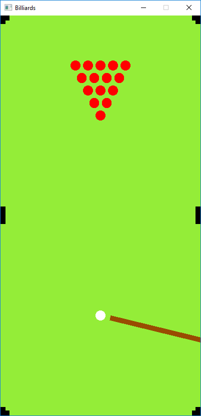

# SDLBilliards

## About

A simple game of billiards implemented using only OpenGL shaders and SDL2. Done as a coding exercise.

## Build

  1. Clone repo and open SDLBilliards.sln.
  2. Include and link: SDL2, glm and glad.
  3. Build project SDLBilliards.
  4. Copy SDL2.dll to output directory.

## Demo

